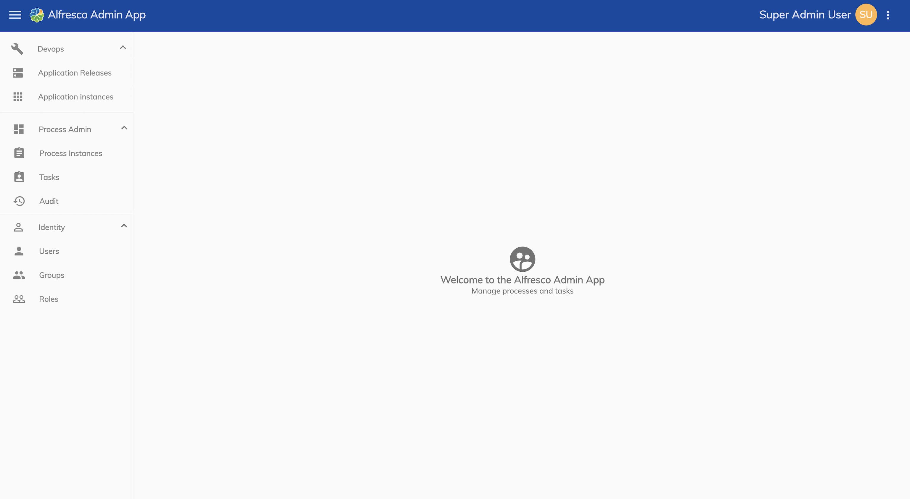

# Alfresco Administrator Application
The Alfresco Administrator Application is used to [deploy projects](../administrator/admin-deploy.md) that have been designed in the Alfresco Modeling Application and [manage users and permissions](../administrator/admin-identity/README.md) for Activiti Enterprise. 

**Note**: It is important to note that once a project has been deployed it is referred to as an application. 

The Administrator Application has three distinct functions that are controlled by separate permissions. They are as follows:

* A **Devops** section for [deploying released projects](../administrator/admin-deploy.md) and [monitoring applications](../administrator/admin-deploy.md#monitoring-applications).

* A **Process Admin** section for [monitoring tasks](../administrator/admin-monitoring.md#monitoring-tasks), [monitoring processes](../administrator/admin-monitoring.md#monitoring-processes) and [audit functions](../administrator/admin-monitoring.md#audit).

* An **Identity** section for [managing users, groups and roles](../administrator/admin-identity/README.md). 

The URL of the Administrator Application will be in the format: `{my-domain}/admin`. 

## About
The about page can be accessed via the UI or at the URL: `{my-domain}/admin/about` and shows the packages and package versions used in the application. 

## Settings
You can view the application configuration of the Administrator Application by visiting the URL:`{my-domain}/admin/app.config.json`. 

