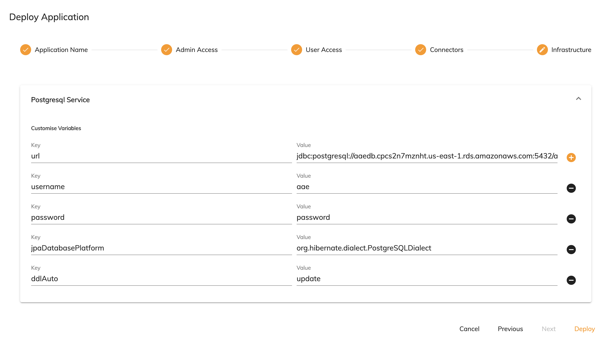
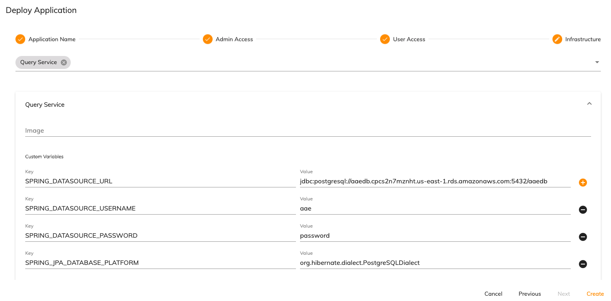

# Customizing application infrastructure
Certain aspects of the infrastructure can be configured on an application by application basis. The infrastructure can be customized using the deployment service API or through the Administrator Application UI when deploying an application. The following are the areas that can be customized: 

* [Configuring external Postgres instances](#configuring-external-postgres-instances)
* [Configuring an event bridge](#configuring-an-event-bridge)
* [Deploying an application with custom images](#deploying-an-application-with-custom-images)

## Configuring external Postgres instances
By default, data for the application runtime bundle and application query service is stored in an instance of Postgres deployed into an application namespace. A number of options are available to update the Postgres storage options: 

* [Use an external Postgres instance for all services](#use-an-external-postgres-instance-for-all-services)
* [Use separate an external Postgres instance(s) for each service](#use-an-external-postgres-instance(s)-for-each-service)

### Use an external Postgres instance for all services
If the variables for the `postgresql-service` are updated to point to an external instance of Postgres, all services will use this external instance. 

The following is an example deployment payload specifying these variables:

```json
{
  "name": "external-postgres-application",
  "releaseId": "29925e2b-ef26-49df-9156-ea3a2a910c42",
  "security": [
    {
      "role": "ACTIVITI_ADMIN",
      "users": ["..."]
    },
    {
      "role": "ACTIVITI_USER",
      "users": ["..."]
    }
  ],
  "variables": {
	    "postgresql-service":{
        "url":"jdbc:postgresql://aaedb.cpcs2n7mznht.us-east-1.rds.amazonaws.com:5432/aaedb",
        "username": "aae",
        "password": "password",
        "jpaDatabasePlatform":"org.hibernate.dialect.PostgreSQLDialect",
        "ddlAuto": "update"
      }
  }
}
```

In the Administrator Application, this would look similar to the following: 



### Use an external Postgres instance(s) for each service
An external instance of Postgres can be specified at the service level. This means that as few or as many services can use an external instance as required. The external instances can be different for each service. Any service that does not have a Postgres instance specified will use the `postgresql-service` settings as its default. 

The following is an example deployment payload where the application query service is set to use an external instance of Postgres: 

```json
{
  "name": "application-external-postgres",
  "releaseId": "29925e2b-ef26-49df-9156-ea3a2a910c42",
  "security": [
    {
      "role": "ACTIVITI_ADMIN",
      "users": ["..."]
    },
    {
      "role": "ACTIVITI_USER",
      "users": ["..."]
    }
  ],
  "variables": {
	  "query-service": {
		  "SPRING_DATASOURCE_URL":"jdbc:postgresql://aaedb.cpcs2n7mznht.us-east-1.rds.amazonaws.com:5432/aaedb",
		  "SPRING_DATASOURCE_USERNAME": "aae",
		  "SPRING_DATASOURCE_PASSWORD": "password",
		  "SPRING_JPA_DATABASE_PLATFORM":"org.hibernate.dialect.PostgreSQLDialect",
		  "SPRING_JPA_HIBERNATE_DDL_AUTO": "update"
	  }
  }
}
```

In the Administrator Application, this would look similar to the following:



## Configuring an event bridge 
An external event bridge can be added to an application at deployment time that routes integration and runtime events to an external service. The services that events can be sent to are:

* [Elasticsearch](#elasticsearch)
* [Kafka](#kafka)

Runtime events are events that are emitted by the [application runtime bundle](../../architecture/application.md#application-runtime-bundle). 

Integration events are events that are emitted by [connectors](../../modeling/connectors/README.md). For example, if using the [email connector](../../modeling/connectors/ootb/email.md), the event bridge will listen to events in the queue named `emailConnector.SEND`. 

### Elasticsearch
The following are the key value pairs that can be set when using [Elasticsearch](https://www.elastic.co/):

| Environment variable | Description | 
| -------------------- | ----------- | 
| `ES_HOST` | The Elasticsearch host to use |
| `ES_PORT` | The port to use for the Elasticsearch instance |
| `ES_SCHEME` | The protocol to use to communicate with Elasticsearch |
| `ES_INTEGRATION_INDEX` | The name of the index for integration events. The default is `integration` |
| `ES_RUNTIME_INDEX` | The name of the index for runtime events. The default is `cloudruntime` |
| `ES_PATH` | The path to Elasticsearch on the server running it. If Elasticsearch is installed at the route this setting does not need to be set |
| `GATEWAY_RUNTIME_EVENT_TYPES_SUPPORTED` | A comma separated list of runtime events to capture in Elasticsearch. `*` is supported as a wildcard, for example `PROCESS_*`. The default value is `*` |
| `GATEWAY_INTEGRATION_CONSUMER_DEST` | A comma separated list of integration events to capture in Elasticsearch using connector queues. Connector queues use the `implementation` value of a connector. For example if an email connector and a Textract connector are used then this value should be set to `emailConnector.SEND, textractConnector.EXTRACT` |

### Kafka
The following are the key value pairs that can be set when using [Kafka](https://kafka.apache.org/):

| Environment variable | Description | 
| -------------------- | ----------- | 
| `GATEWAY_KAFKA_BINDER_BROKERS` | The location of the Kafka instance to send events to | 
| `GATEWAY_KAFKA_BINDER_BROKERS_PORTS` | The port to use for the Kafka instance |
| `GATEWAY_KAFKA_BINDER_REPLICATION_FACTOR` | The number of replications to create |
| `GATEWAY_KAFKA_BINDER_AUTO_CREATE_TOPICS` | Sets whether topics are created automatically or not |
| `GATEWAY_INTEGRATION_PRODUCER_DEST` | The producer destination for integration events |
| `GATEWAY_RUNTIME_PRODUCER_DEST` | The producer destination for runtime events | 
| `GATEWAY_RUNTIME_EVENT_TYPES_SUPPORTED` | A comma separated list of runtime events to capture in Kafka. `*` is supported as a wildcard, for example `PROCESS_*`. The default value is `*` |
| `GATEWAY_INTEGRATION_CONSUMER_DEST` | A comma separated list of integration events to capture in Kafka using connector queues. Connector queues use the `implementation` value of a connector. For example if an email connector and a Textract connector are used then this value should be set to `emailConnector.SEND, textractConnector.EXTRACT` |
| `SPRING_CLOUD_STREAM_KAFKA_BINDER_CONFIGURATION_SECURITY_PROTOCOL` | Sets the security protocol to introduce between clients and the broker, for example `SASL_PLAINTEXT` |
| `SPRING_CLOUD_STREAM_KAFKA_BINDER_CONFIGURATION_SASL_MECHANISM` | The authentication mechanism to use, for example `PLAIN` or `SCRAM-SHA-256` | 
| `SPRING_CLOUD_STREAM_KAFKA_BINDER_CONFIGURATION_SASL_JAAS_CONFIG` | The username and password for authentication, for example `org.apache.kafka.common.security.scram.ScramLoginModule required username="USERNAME" password="PASSWORD";` | 

## Deploying an application with custom images
The [application runtime bundle](https://github.com/Alfresco/example-process-application/tree/master/example-application-project/project) can be replaced with a custom Docker image. The definition XML and JSON files for processes, forms, DMN and scripts need to be placed in the relevant folders.

1. Clone the example runtime bundle repository:

	```
	git clone https://github.com/Alfresco/example-process-application.git
	```

2. Clear out the example files in the directories under the `/project/` folder and insert the XML process definitions and JSON process extension files for the new application in their place. 

3. Edit the `Dockerfile` and set the location of where the XML and JSON files will be located in the created image. The default is `maven/processes`.

4. Update the value of `{DOCKER_REGISTRY}` in the `env.sh` file to point to the Docker registry of the Kubernetes namespace. 

5. Create and push the image using the following command: 

	```bash
	export DOCKER_IMAGE_TAG=<branch>
	./build.sh
	./push.sh
	```
