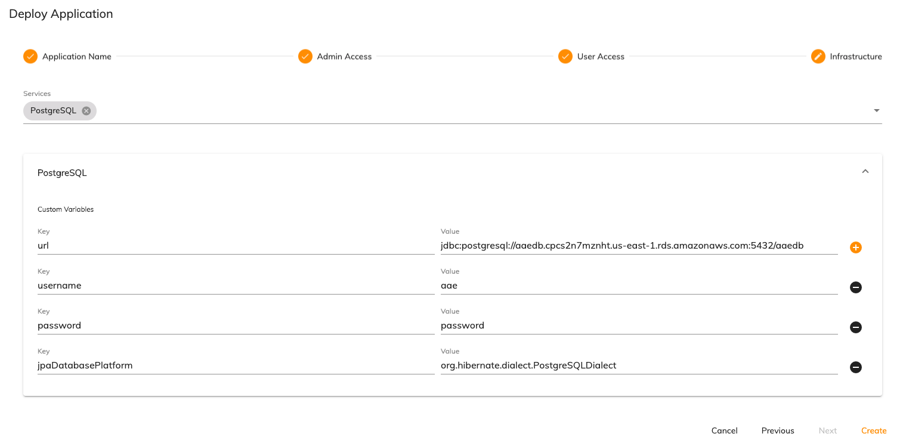

# Customizing application infrastructure
Certain aspects of the infrastructure can be configured on an application by application basis. The infrastructure can be customized using the deployment service API or through the Administrator Application UI when deploying an application. The following are the areas that can be customized: 

* [Configuring external Postgres instances](#configuring-external-postgres-instances)
* [Deploying an application with custom images](#deploying-an-application-with-custom-images)

## Configuring external Postgres instances
By default, data for the audit service, query service, notification service, preference service, form service and runtime bundle is stored in an instance of Postgres deployed into an application namespace. A number of options are available to update the Postgres storage options: 

* [Use an external Postgres instance for all services](#use-an-external-postgres-instance-for-all-services)
* [Use separate an external Postgres instance(s) for each service](#use-an-external-postgres-instance(s)-for-each-service)

### Use an external Postgres instance for all services
If the variables for the `postgresql-service` are updated to point to an external instance of Postgres, all services will use this external instance. 

The following is an example deployment payload specifying these variables:

```json
{
  "name": "external-postgres-application",
  "releaseId": "29925e2b-ef26-49df-9156-ea3a2a910c42",
  "security": [
    {
      "role": "ACTIVITI_ADMIN",
      "users": ["..."]
    },
    {
      "role": "ACTIVITI_USER",
      "users": ["..."]
    }
  ],
  "variables": {
	    "postgresql-service":{
        "url":"jdbc:postgresql://aaedb.cpcs2n7mznht.us-east-1.rds.amazonaws.com:5432/aaedb",
        "username": "aae",
        "password": "password",
        "jpaDatabasePlatform":"org.hibernate.dialect.PostgreSQLDialect",
        "ddlAuto": "update"
      }
  }
}
```

In the Administrator Application, this would look similar to the following: 



### Use an external Postgres instance(s) for each service
An external instance of Postgres can be specified at the specific service level. This means that as few or as many services can use an external instance as required. The external instances can be different for each service. Any service that does not have a Postgres instance specified will use the `postgresql-service` settings as its default. 

The following is an example deployment payload where the query service is set to use an external instance of Postgres: 

```json
{
  "name": "application-external-postgres",
  "releaseId": "29925e2b-ef26-49df-9156-ea3a2a910c42",
  "security": [
    {
      "role": "ACTIVITI_ADMIN",
      "users": ["..."]
    },
    {
      "role": "ACTIVITI_USER",
      "users": ["..."]
    }
  ],
  "variables": {
	  "query-service": {
		  "SPRING_DATASOURCE_URL":"jdbc:postgresql://aaedb.cpcs2n7mznht.us-east-1.rds.amazonaws.com:5432/aaedb",
		  "SPRING_DATASOURCE_USERNAME": "aae",
		  "SPRING_DATASOURCE_PASSWORD": "password",
		  "SPRING_JPA_DATABASE_PLATFORM":"org.hibernate.dialect.PostgreSQLDialect",
		  "SPRING_JPA_HIBERNATE_DDL_AUTO": "update"
	  }
  }
}
```

In the Administrator Application, this would look similar to the following:


## Deploying an application with custom images
The application services that utilize definition files can be replaced with custom Docker images. Example projects are provided for the runtime bundle, form service and DMN service so that definition XML and JSON files can be placed in the images:

* [Runtime bundle](https://git.alfresco.com/process-services-public/alfresco-example-process-runtime-bundle-service/)
* [Form service](https://git.alfresco.com/process-services-public/alfresco-example-forms-service)
* [DMN service](https://git.alfresco.com/process-services-public/alfresco-example-dmn-service)

**Note**: The layout of each project is almost identical. The runtime bundle project will be used as an example.

1. Clone the example runtime bundle repository:

	```
	git clone https://git.alfresco.com/process-services-public/alfresco-example-process-runtime-bundle-service.git
	```

2. Clear out the example files in the `/processes/` folder and insert the XML process definitions and JSON process extension files for the new application in their place. 

3. Edit the `Dockerfile` and set the location of where the XML and JSON files are located in the created image. The default is `maven/processes`.

4. Update the value of `{DOCKER_REGISTRY}` in the `env.sh` file to point to the Docker registry of the Kubernetes namespace. 

5. Create and push the runtime bundle image using the following command: 

	```bash
	export DOCKER_IMAGE_TAG=<branch>
	./build.sh
	./push.sh
	```

**Important** When deploying an application that contains a custom image, environment variables need to be set that specify where the XML and JSON definitions are located in the Docker image. If [deploying a descriptor via Helm](../deploy/README.md#deploying-a-deployment-descriptor-via-helm) they can be set in the `extraEnv` section for the relevant image in the `values.yaml` file. If [deploying using the deployment service](#deployment-steps) then the variables need to be set as key value pairs for the corresponding images. The following is a table of the environment variables for each service:

| Service | Environment variable | 
| ------- | -------------------- |
| Runtime bundle |  `SPRING_ACTIVITI_PROCESSDEFINITIONLOCATIONPREFIX` |
| Form service | `FORMCONFIGURATION_FORMSDEFINITIONSDIRECTORYPATH` | 
| DMN service | `DMNCONFIGURATION_TABLESDEFINITIONSDIRECTORYPATH` |

The following is an example of setting the runtime bundle path in the `extraEnv` section of a Helm chart:

```yaml
-  extraEnv: |
	- name: SPRING_ACTIVITI_PROCESSDEFINITIONLOCATIONPREFIX
	- value: "file:/process-definitions/"
```

The location of the [project manifest](../../modeling/projects.md#files) also needs to be set for each service using the environment variable `PROJECT_MANIFEST_FILE_PATH`, for example: 

```yaml
-  extraEnv: |
	- name: PROJECT_MANIFEST_FILE_PATH
	- value: "file:project/project.json/"
```
