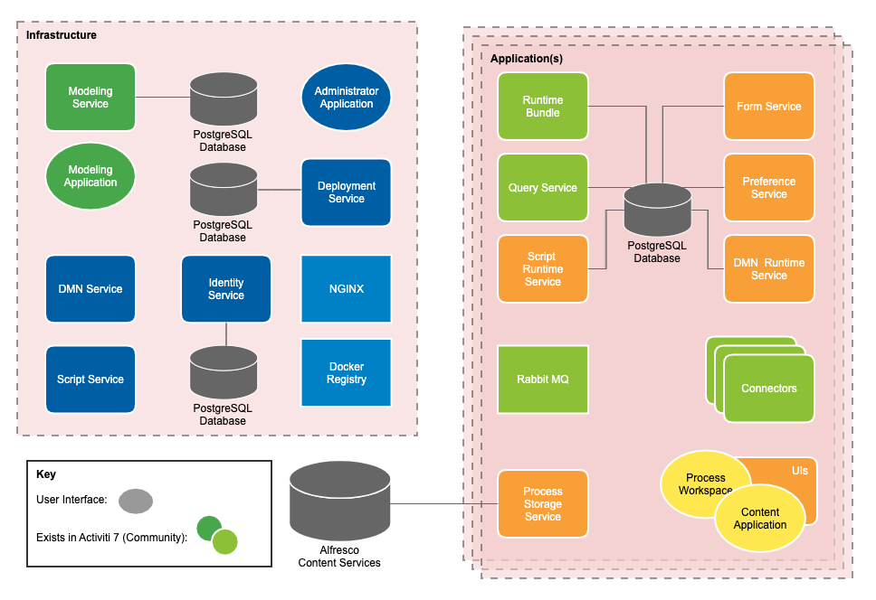

# Architecture
The following diagram describes the architecture of Alfresco Activiti Enterprise: 

## Services
Alfresco Activiti Enterprise is comprised of microservices and components. These services can be considered platform level services or application level services. 

* [Platform services](../architecture/platform.md) are those used across the whole platform to manage applications and support user interfaces.

* [Application services](../architecture/application.md) are those deployed as part of an application to manage the running of process instances and tasks. 

## User interfaces
There are [three user interfaces](../architecture/ui.md) for Activiti Enterprise that assist in managing different stages of process development, deployment and interaction.

## APIs 
There are a number of [REST APIs](../apis/README.md) exposed for different services by Activiti Enterprise that can be used in addition to, or in place of, the user interfaces.

