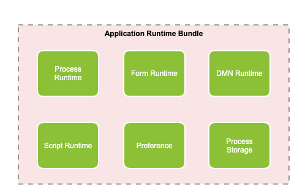
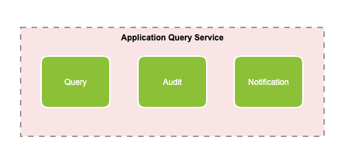

# Application services
Application Services are those that are deployed into a Kubernetes namespace as part of an application. There is a 1:1 relationship between Kubernetes namespaces and applications. Each application that is deployed will contain application level services specific to only that application in its own Kubernetes Namespace. 

The application name forms part of the REST API endpoints. 

## Application runtime bundle
The application runtime bundle is a service that contains the following: 

The application runtime bundle stores data in a Postgres database that is shared with the [application query service](#application-query-service), with data separated into separate schemas. A database is deployed into each namespace by default, however an external instance can be used as the target instead.

### Process runtime
The process runtime is a stateless instance of the process engine that executes an immutable set of process definitions. Each instance of the process engine only contains a single application.

A synchronous REST API and an asynchronous message-based API are exposed by the process engine and events are emitted and consumed via Spring Cloud Streams. A list of [engine events](events.md) and their classes is available.

### Form runtime
The form runtime contains the functionality required for [forms](../modeling/forms/README.md) to function within an application.  

### DMN runtime
The DMN runtime contains the functionality required for [decision tables](../modeling/decisions.md) to function within an application. 

### Script runtime 
The script runtime contains the functionality required to execute [scripts](../modeling/scripts.md) within an application.

### Preference
User preferences are retained in a key value store within the application database. 

### Process storage
Process storage optionally stores process instances and tasks as nodes within an [Alfresco Content Services (ACS)](http://docs.alfresco.com/6.2/concepts/welcome.html) repository. 

The user that creates these nodes in ACS is **service-account-storage-service**.  

## Application query service
The application query service contains the following: 

The application query service stores data in a Postgres database that is shared with the [application runtime bundle](#application-runtime-bundle), with data separated into separate schemas. A database is deployed into each namespace by default, however an external instance can be used as the target instead.

### Query
Tables for querying application data are separate to the runtime so that queries can be run without accessing any runtime services. Some data aggregation is performed on the tables to improve querying.

### Audit 
Audit log tables for all application transactions are separate to the runtime so that they can be queried without accessing any runtime services. No data aggregation or manipulation is run against audit logs to enforce an accurate audit trail. 

### Notification 
The tables used for querying application data are also be used to setup [GraphQL](https://graphql.org/learn/) against in order to query specific events and use web sockets with. 

## Connectors
Connectors are used to execute logic outside of processes and the [application runtime bundle](#application-runtime-bundle). Connectors are attached to a [service task](../modeling/processes/bpmn/service.md) within a process definition. When the process flow reaches the service task, the values are sent from the process instance to a connector using Spring Cloud Streams via [Rabbit MQ](#rabbit-mq) to be used as part of the logic. The results are sent back to the process instance after the connector has finished and the process flow continues.

## Rabbit MQ
[Rabbit MQ](https://www.rabbitmq.com/) is the default message broker deployed with Activiti Enterprise that routes the events emitted by the runtime bundle asynchronously to other services.