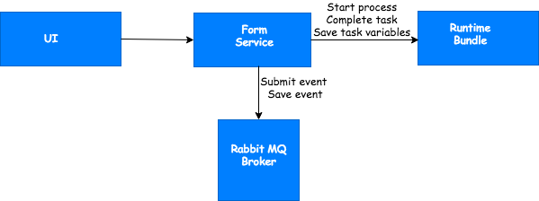
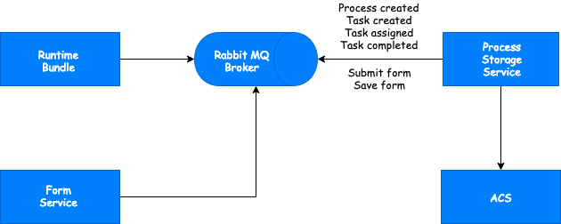

# Application Services
Application Services are those that are deployed into a Kubernetes namespace as part of an application. There is a 1:1 relationship between Kubernetes namespaces and applications. Each application that is deployed will contain application level services specific to only that application in its own Kubernetes Namespace. 

The application name therefore forms part of the REST API endpoints. 

## Runtime Bundle
A runtime bundle represents a stateless instance of the process engine that executes an immutable set of process definitions. It is important to note that you cannot deploy new process definitions to an existing runtime bundle, nor can you update a process definition within it. Instead, you create a new version of your runtime bundle that contains the updates. 

Runtime Bundles expose a synchronous REST API and an asynchronous message-based API. Each Runtime Bundle contains a single application and each application is deployed to its own Namespace. 

Runtime Bundles emit and consume events that occur within processes via Spring Cloud Streams. A description of [engine events](events.md) and their classes is available.

By default, the data is stored in a Postgres database that is shared within an application namespace between the Query Service, Preference Service, Form Service and Runtime Bundle. This can be updated to point to a Postgres data store external to an application’s namespace or even external to the cluster. 

The REST APIs that the runtime bundle exposes deal with processes and tasks and are specific to each application. 

## Query Service
The Query Service is used for querying process data without accessing the [runtime bundle](#runtime-bundle) directly. It consumes the events produced by the runtime bundle that are routed via Spring Cloud Streams through the [Rabbit MQ](#rabbit-mq) binder. 

The query service contains tables that have had some level of data aggregation performed on them for querying purposes. These tables can also be used to setup [GraphQL](https://graphql.org/learn/) against to query specific events and use web sockets with. 

Another set of tables within the query service store events without any data manipulation and are used as an audit trail for each application. These audit events can be queried without accessing the runtime bundle directly. 

By default, the data is stored in a Postgres database that is shared within an application namespace between the Query Service, Preference Service, Form Service and Runtime Bundle. This can be updated to point to a Postgres data store external to an application’s namespace or even external to the cluster. 

The REST APIs that the query service exposes deal with processes and tasks and are specific to each application. 

## Form Service
The Form Service contains the backend functionality required for [forms](../modeling/forms/README.md) to function within an application. 

By default, the data is stored in a Postgres database that is shared within an application namespace between the Query Service, Preference Service, Form Service and Runtime Bundle. This can be updated to point to a Postgres data store external to an application’s namespace or even external to the cluster. 

The REST APIs that the Form service exposes deal with forms and are specific to each application.

The following is a high level diagram of the Form service:

## Process Storage Service
The Process Storage Service stores process instances and tasks as nodes within an [Alfresco Content Services (ACS)](http://docs.alfresco.com/6.1/concepts/welcome.html) repository. 

The user that creates these nodes in ACS is **service-account-storage-service**.  

The REST APIs that the Process Storage Service exposes deal with folders and files and are specific to each application.  

The following is a high level diagram of the process storage service:

## DMN Runtime Service
The DMN Runtime Service contains the backend functionality required for [decision tables](../modeling/decisions.md) to function within an application. 

## Rabbit MQ
[Rabbit MQ](https://www.rabbitmq.com/) is the default message broker deployed with Activiti Enterprise that routes the events emitted by the runtime bundle asynchronously to other relevant microservices such as the audit and query services. 

Rabbit MQ is the default implementation, but can be replaced by a different message broker. 

## Preference Service
The Preference Service is a key value store that retains user-based preferences. By default, the data is stored in a Postgres database that is shared within an application namespace between the Query Service, Preference Service, Form Service and Runtime Bundle. This can be updated to point to a Postgres data store external to an application’s namespace or even external to the cluster. 

## Connectors
Connectors are used to execute logic outside of processes and the [runtime bundle](#runtime-bundle). Connectors are attached to a [service task](../modeling/processes/bpmn/service.md) within a process definition. When the process flow reaches the service task, the values are sent from the process instance to a connector using Spring Cloud Streams via [Rabbit MQ](#rabbit-mq) to be used as part of the logic. The results are sent back to the process instance after the connector has finished and the process flow continues.

## Script Runtime Service
The Script Runtime Service contains the backend functionality required to execute [scripts](../modeling/scripts.md) within an application. Scripts are executed outside of the runtime bundle with the results being passed back using Rabbit MQ.