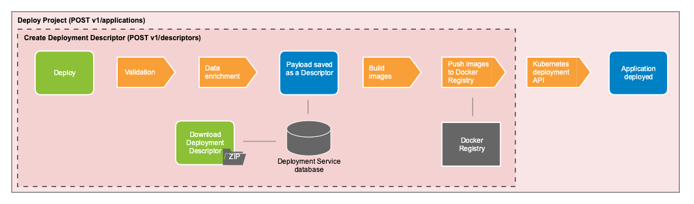

# Platform services
Platform services are those services that are deployed into a single Kubernetes namespace and are used by Activiti Enterprise to manage applications and services across the entire deployment, irrespective of how many individual applications are deployed.

## Modeling service
The modeling service contains the backend functionality required for the [Alfresco Modeling Application](../modeling/README.md) to run. It requires an instance of Postgres deployed with it for storing project and model definitions that the [deployment service](#deployment-service) uses to deploy projects. This instance of Postgres is deployed at a platform level and is independent of the one used by the [application services](../architecture/arch-application.md). It is also independent of the Postgres instance used by the deployment service.

The REST APIs that the modeling service exposes deal with projects, models and releases. 

The following is a high level diagram of the modeling service:

## Deployment service
The deployment service is used to create deployment descriptors and deploy projects. A deployment descriptor can be used to download an application in Helm format and subsequently be deployed manually. Using the deployment service to deploy an application still creates the descriptor but also deploys the application into the Activiti Enterprise cluster in its own namespace. 

The following diagram shows the steps that the deployment service takes to create a deployment descriptor and deploy an application:

Once a payload has been submitted to the deployment service through the API or using the Administrator Application a sequence of events happen:

* The first thing is validation to ensure the payload contains no errors and that there are no conflicts with any other application names already deployed into the cluster. 
* Once validation has passed a series of data enrichment is applied to the payload specifying default values. 
* After data enrichment is complete the payload is saved to the deployment service database as a descriptor. By default this is a PostgreSQL database instance called **alfresco-deployment**.
* An image is then built using the Docker Java client and Docker daemon for the runtime bundle and the form service and DMN service (if those features were present in the project). The images for the [other services in an application](../architecture/arch-application.md) are pre-built and everything is pushed to the internal Docker registry. 

	**Note**: At this point a deployment descriptor can be downloaded.

* The final stage to deploy uses the Kubernetes API to deploy the images into their own namespace.

	**Note**: If you only created a deployment descriptor, it is still possible to deploy it using the deployment service as well as download it and deploy it manually. 

## Alfresco Content Services
An instance of [Alfresco Content Services (ACS)](https://docs.alfresco.com/6.1/references/whats-new.html) is deployed as part of Alfresco Activiti Enterprise to store information about in progress tasks and processes in a content repository. ACS is not required to use Activiti Enterprise and the data for tasks and processes is still stored in databases.

## Identity Service
Alfresco Activiti Enterprise uses the [Identity Service](https://docs.alfresco.com/identity/concepts/identity-overview.html) for authentication and user and role management throughout the product. Authentication can be [configured](http://docs.alfresco.com/identity/concepts/identity-configure.html) to external identity provider instances such as LDAP and SAML. 

The [Alfresco Administrator Application](../administrator/admin-identity/README.md) allows administrators to manage common user-related functions without needing to access the Identity Service. 
