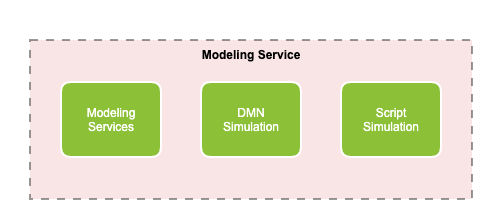

# Platform services
Platform services are those services that are deployed into a single Kubernetes namespace and are used by Activiti Enterprise to manage applications and services across the entire deployment, irrespective of how many individual applications are deployed.

## Modeling service
The modeling service contains the backend functionality required for the [Alfresco Modeling Application](../modeling/README.md) to run. It requires an instance of Postgres deployed with it for storing project and model definitions that the [deployment service](#deployment-service) uses to deploy projects. This instance of Postgres is deployed at a platform level and is independent of the one used by the [application services](../architecture/arch-application.md). It is also independent of the Postgres instance used by the deployment service.

The REST APIs that the modeling service exposes deal with projects, models and releases. 

The following is a high level diagram of the modeling service:

## Deployment service
The deployment service is used to deploy projects. 

A set of validation rules are applied to the project and against other deployed applications to avoid duplication within the cluster. 

Once validation is passed, a series of data enrichment is applied to the payload to specify default values. 

The payload is saved as a deployment descriptor in the deployment service database. By default this is its own PostgreSQL database instance called **alfresco-deployment**.

Images are built Docker java client that talks to the docker daemon to build images. We only build RB, form and DMN and the others are used from on top of the Alfresco base image. Built images are then pushed to the Docker registry. 

The deployment service then uses the Kubernetes API to deploy all the images that make up a released project.

The deployment service uses the Docker API to build an image for the runtime bundle. It also creates images for the form service and DMN service depending on whether there are any forms or decision tables present in the released project. 

This service uses the project and model definitions created using the [Alfresco Modeling Application](../modeling/README.md) and stored in an instance of Postgres to deploy the [application level services](../architecture/arch-application.md) into their own namespaces. The [Alfresco Administrator Application](../administrator/README.md) calls the deployment service when managing projects and applications.

The following is a high level diagram of the deployment service:

The REST APIs that the deployment service exposes deal with applications.

## Alfresco Content Services
An instance of [Alfresco Content Services (ACS)](https://docs.alfresco.com/6.1/references/whats-new.html) is deployed as part of Alfresco Activiti Enterprise to store information about in progress tasks and processes in a content repository. ACS is not required to use Activiti Enterprise and the data for tasks and processes is still stored in databases.

## Identity Service
Alfresco Activiti Enterprise uses the [Identity Service](https://docs.alfresco.com/identity/concepts/identity-overview.html) for authentication and user and role management throughout the product. Authentication can be [configured](http://docs.alfresco.com/identity/concepts/identity-configure.html) to external identity provider instances such as LDAP and SAML. 

The [Alfresco Administrator Application](../administrator/admin-identity/README.md) allows administrators to manage common user-related functions without needing to access the Identity Service. 
