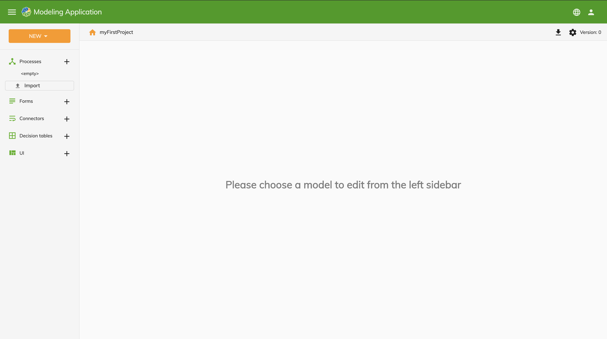

# Alfresco Modeling Application

The Alfresco Modeling Application is used to create and update the components that make up an Alfresco Activiti Enterprise project. These include: 

* [Projects](../modeling/modeling-projects.md) are the top level component of a business application. The other components all sit within a project definition:

* [Processes](../modeling/modeling-processes/README.md) use BPMN elements to model a business process. They incorporate the other components created in the Modeling Application.

* [Forms](../modeling/modeling-forms/README.md) are used to collect data from end-users and are attached to a start event or user task within a process.

* [Connectors](../modeling/modeling-connectors/README.md) are used to execute logic outside of processes. Values are sent from a process to a connector to be used as part of the logic and the results sent back to the process instance afterwards.

* [Decision tables](../modeling/modeling-decisions.md) are used to make business decisions as part of a process. 

* [User interfaces](../modeling/modeling-interfaces.md) are for associating user interfaces with an applications. 

## Modeling
All components of an application can be designed using a Graphical User Interface (GUI) or an XML or JSON editor. Users require the *APS_MODELER* role in order to create projects within the Modeling Application. 

The [files that comprise an application](../modeling/modeling-projects.md#files) are stored in an instance of Alfresco Content Services (ACS). Process instances and tasks that are running can also be stored in a separate repository as nodes, including any content uploaded to them.

The URL of the Modeling Application will be in the format: `gateway.{domain-name}/modeling`.

## About
The about page can be accessed via the UI or at the URL: `gateway.{domain-name}/modeling/about` and shows the packages and package versions used in the application. 

## Settings
You can view the application configuration of the Modeling Application by visiting the URL: `gateway.{domain-name}/modeling/app.config.json`.