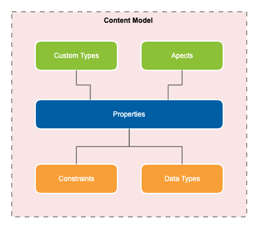

# Content models
Content models describe how data should be stored in the content repository and the metadata that can be associated to the content and folders within a model. 

Each model is identified by a unique namespace, prefix and name and made up of custom types, aspects, properties and constraints. 



## Modeling content models
To create and manage content models users require the `ACTIVITI_MODELER` role and to also be part of the `ALFRESCO_MODEL_ADMINISTRATORS` group in Alfresco Content Services (ACS).

Content models have a status of **Active** or **Inactive** which can be changed by selecting the action to **Activate** or **Deactivate** a model. 

* **Active** content models can have their types and aspects applied to files and folders within ACS. 
* **Inactive** content models cannot have their types and aspects applied to files and folders within ACS. 

**Note** An active content model cannot be made inactive if there are files and folders with its types and aspects applied anywhere in ACS. 

The properties for a content model are: 

| Property | Description | Example | Required? | 
| -------- | ----------- | ------- | --------- | 
| `Namespace` | A namespace unique within the repository for the content model to sit under. This ensures that all custom types, aspects and properties are also unique within the repository. Namespaces can only contain alphanumeric characters and must be URIs. | http://finance.com/model/accounts/1.0 | Yes | 
| `Prefix` | An abbreviation of the `namespace` of a content model to refer to types and aspects without needing to use the full namespace. Prefixes can only contain alphanumeric characters, hyphens and underscores. | fin-acc | Yes | 
| `Name` | The name of the content model. Content model names can only contain alphanumeric characters, hyphens and underscores. | Financial Accounts Model | Yes | 
| `Creator` | The author of the model. The default value is the currently signed in user. | hruser | No | 
| `Description` | A free text description of what the content model is for | A content model for recording financial accounts records. | No | 

### Custom types
Custom types set the properties and relationships that a file of that type can support. Custom types can inherit the properties of a parent type. `Content` and `Folder` are two example types that are already defined in ACS. 

The properties for a custom type are: 

| Property | Description | Example | Required? | 
| -------- | ----------- | ------- | --------- | 
| `Name` | The name of the custom type. Custom type names can only contain alphanumeric characters, hyphens and underscores. | supplier-invoice | Yes |
| `Parent type` | A parent type for the custom type. All properties and aspects assigned to the parent are inherited by the child. | cm:content | Yes | 
| `Title` | A display label for the custom type that will be displayed to users | Supplier Invoice | No | 
| `Description` | A free text description of what the custom types is for | An invoice received from a supplier. | No | 

Custom types are stored as JSON, for example: 

```json
{
  "parentName": "cm:content",
  "name": "supplier-invoice",
  "prefixedName": "fin-acc:supplier-invoice",
  "description": "An invoice received from a supplier.",
  "title": "Supplier Invoice",
  "properties": []
}
```

### Aspects
Aspects are a collection of properties that can be used to describe data and behaviour. A file must be of one type, however it can have multiple aspects attached to it. `Classifiable` and `Versionable` are two example aspects that are already defined in ACS.

The properties for an aspect are: 

| Property | Description | Example | Required? | 
| -------- | ----------- | ------- | --------- | 
| `Name` | The name of the custom aspect. Custom aspect names can only contain alphanumeric characters, hyphens and underscores. | isArchivable | Yes |
| `Title` | A display label for the custom aspect that will be displayed to users | Archivable | No | 
| `Description` | A free text description of what the custom aspect is for | The status of the document for archiving purposes. | No | 

Aspects are stored as JSON, for example:

```json
{
  "name": "isArchivable",
  "prefixedName": "fin-acc:isArchivable",
  "description": "The status of the document for archiving purposes.",
  "title": "Archivable",
  "properties": []
}
```

### Properties
Properties are the metadata that describe content. `Author` is an example property that is already defined in ACS used for specifying who wrote the content. 

Properties can be assigned to a custom type or an aspect. Select which type or aspect to create the property under before creating it.

The properties for properties are:

| Property | Description | Example | Required? | 
| -------- | ----------- | ------- | --------- | 
| `Name` | The name of the property. Property names can only contain alphanumeric characters, hyphens and underscores. | datePaid  | Yes |
| `Title` | A display label for the property that will be displayed to users | Date Paid | No | 
| `Description` | A free text description of what the property is for | The date the invoice was paid. | No | 
| `Data type` | The data type of the property. See the following table for a list of data types. | d:date | No | 
| `Mandatory` | Set whether the property is mandatory | false | No | 
| `Multiple` | Set whether the property can contain multiple values | false | No | 
| `Default value` | Set a default value for the property | | No | 

The data types for properties are:

| Data type | Description |  
| --------- | ----------- |
| `d:text` | A sequence of characters | 
| `d:mltext` | A multilingual sequence of characters containing localized representations | 
| `d:int` | A positive whole number |
| `d:float` | A float value |
| `d:double` | A double value generally used for decimal values | 
| `d:date` | A specific date in the format `DD-MM-YYYY` | 
| `d:datetime` | A specific date and time |
| `d:boolean` | A value of either `true` or `false` |

Properties are stored as JSON, for example:

```json
{
  "name": "datePaid",
  "prefixedName": "fin-acc:datePaid",
  "title": "Date Paid",
  "description": "The date the invoice was paid.",
  "dataType": "d:date",
  "facetable": "UNSET",
  "indexTokenisationMode": "TRUE",
  "multiValued": false,
  "mandatoryEnforced": false,
  "mandatory": false,
  "indexed": true
}
```