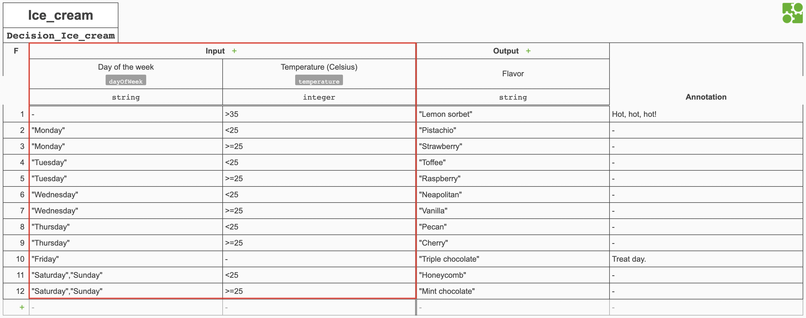
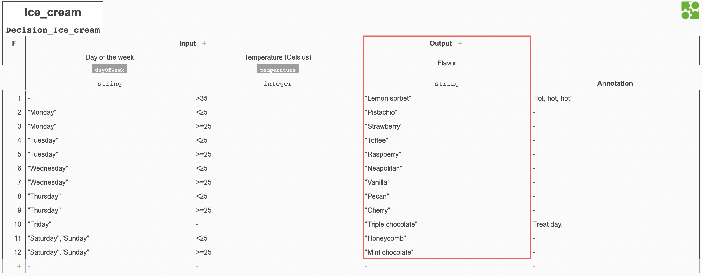

---
Title: Decision tables
--- 

# Decision tables
Decision tables are used to manage business decisions within process workflows. They adhere to the Decision Model and Notation (DMN) standard. 

Decision tables take at least one input and have at least one output. The inputs are evaluated against a set of rules defined by the modeler and then produce the relevant output(s) that match those rules to the process. 

## Naming  
Decision table names must be in lowercase and between 1 and 26 characters in length. Alphanumeric characters and hyphens are allowed, however the name must begin with a letter and end alphanumerically. 

The following are examples of valid decision table names: 

```
ice-cream-decision-table
dt4
decision-table-omega
```

## Using decision tables
Decision tables can be added to a process definition by creating a [business rule task](../modeling/processes/bpmn/business.md) and selecting the `name` of a decision table created in the project from the dropdown.

[Process variables](../modeling/processes/variables.md) are used to pass values into inputs and receive the value for outputs from a decision table. Specific process variables can be mapped to the inputs and outputs of a decision table, or all process variables can be passed. If all process variables are passed to a decision table then inputs will attempt to be matched against process variables using their names and outputs will either update a matching process variable or create a new one.  

## Designing decision tables
The following is a decision table that selects the best flavor of ice cream to eat based on which day of the week it is and what the temperature is. This example will be used to assist in explaining the different elements that make up a decision table.


### General
Decision tables have a `name` and `id`, with the `name` being used to link a decision table to a service task. 

The following is the XML for the general properties of the ice cream decision table:

```xml
<decision id="Decision_Ice_cream" name="Ice_cream">
```

### Inputs
Inputs are the fields a decision table evaluates against. In the ice cream decision table the inputs are `dayOfWeek` and `temperature` of data types `string` and `integer` respectively. [Process variables](../modeling/processes/variables.md) are used to pass the value of an input into the decision table to be evaluated. Inputs also contain a label which are `Day of the week` and `Temperature (Celsius)` in the example.

The following is the XML for input variable `dayOfWeek`:

```xml
<input id="InputClause_Ice_cream" label="Day of the week" activiti:inputVariable="dayOfWeek">
   <inputExpression id="LiteralExpression_Ice_cream" typeRef="string" />
</input>
```



Input entries, or values are the possible input values to match against for each rule in a decision table. In the ice cream example, possible values include `Monday` and `>=25`.

**Note**: Inputs can have a `-` in a column that matches any value passed in. This appears as blank in the associated XML. 

The following is the XML for the input entry of row 1:

```xml
<inputEntry id="UnaryTests_0pwpzaz">
   <text></text>
</inputEntry>
<inputEntry id="UnaryTests_0g2rex3">
   <text>&gt;35</text>
</inputEntry>
```

Input entries use the FEEL (Friendly Enough Expression Language) language.

### Outputs
Outputs are the result(s) that a decision table comes to after evaluating the inputs. Output columns have a `name` and a `label`. Output values can be passed back to the process using [Process variables](../modeling/processes/variables.md). In the ice cream decision table the output `name` is `flavor` and it is of data type `string`. 

The following is the XML for the output from the ice cream decision table

```xml
<output id="OutputClause_Ice_cream" label="Flavor" name="flavor" typeRef="string" />
```



Output entries are the possible outputs for each rule in a decision table. In the ice cream example, possible values include `Triple chocolate` and `Honeycomb`. 

The following is the output entry for row 10:

```xml
<outputEntry id="LiteralExpression_1olsqqv">
   <text>"Triple chocolate"</text>
</outputEntry>
```

### Rules
Each row in a decision table is known as a rule. A rule evaluates which outputs are valid for the input(s) provided. In the ice cream flavor example, the following are some of the rules:


* On a Monday when the temperature is below 25°c, you should eat pistachio ice cream.
* On a Wednesday when the temperature is 25°c or above, you should eat vanilla ice cream.
* On a Friday you should eat triple chocolate ice cream, irrespective of temperature. 
* On Saturdays or Sundays when the temperature is 25°c or above, you should mint chocolate ice cream.
* When the temperature is above 35°c you should eat lemon sorbet, irrespective of the day. 

**Note**: If there are multiple inputs in a single rule, decision tables use an *AND* operator between the inputs.

[Simulation](#simulating-decision-tables) allows you to see which rules are satisfied by testing input values. 

The XML for a rule is the combination of the input and output entries with a unique rule `id`. The following is an example for rule or row 12:

```xml
<rule id="DecisionRule_1drb7gg">
   <inputEntry id="UnaryTests_07yha3g">
      <text>"Saturday","Sunday"</text>
   </inputEntry>
   <inputEntry id="UnaryTests_00i1d80">
       <text>&gt;=25</text>
   </inputEntry>
   <outputEntry id="LiteralExpression_1i6ddhb">
        <text>"Mint chocolate"</text>
   </outputEntry>
</rule>
``` 

### Hit policies
Underneath the name of the decision table is a letter that sets the hit policy for a decision table. Hit policies are used to set how rules are evaluated when a decision table is executed. 

Using the ice cream example, the letter is `F` which is a `FIRST` hit policy. This means that whilst multiple rules can be matched, only the first one matched will be returned as the output. The rules are evaluated in the order they are defined in the decision table. 


Hit policies are defined at the top level of a decision table XML: 

```xml
<decisionTable id="DecisionTable_Ice_cream" hitPolicy="FIRST">
```

Other [hit policies](#hit-policy-types) can be used.  

### Annotations
On the far right of a decision table is a column for annotations. This is just a place to store notes and is only visible to the modeler. 


Annotations are contained in a `description` property of a rule in the XML: 

```xml
<rule id="DecisionRule_0vx00qh">
   <description>Treat day.</description>
...
</rule>
```

## Hit policy types 
Hit policies define how many rules can be matched in a decision table and which of the results are included in the output. 

The default hit policy is `UNIQUE`. 

| Hit policy | Description |
| ---------- | ----------- |
| `U`: `UNIQUE` | Only a single rule can be matched. If more than one rule is matched the hit policy is violated |
| `A`: `ANY` | Multiple rules can be matched. All matching rules must have identical entries for their output and if matching rules have different output entries the hit policy is violated | 
| `F`: `FIRST` |  Multiple rules can be matched. Only the output of the first rule that is matched will be used, with rules being evaluated in the order they are defined in the decision table | 
| `R`: `RULE ORDER` |  Multiple rules can be matched. All outputs are returned in the order that rules are defined in the decision table | 
| `O` : `OUTPUT ORDER` | Multiple rules can be matched. All outputs are returned in the order that output values are defined in the decision table |
| `P` : `PRIORITY` | Multiple rules can be matched. Only the output with the highest priority will be used, with priority being calculated based on the order rules are specified in descending order | 
| `C`: `COLLECT` | Multiple rules can be satisfied and multiple outputs will be generated with no ordering. Aggregators can be used to group the results which will generate only a single output. See the following rows for collect aggregators. |
| `C +`: ` COLLECT SUM` | The sum of the output values is used to generate a single output | 
|`C <`: `COLLECT MIN` | The lowest value output is used to generate a single output |
| `C >`: `COLLECT MAX`| The highest value output is used to generate a single output |
| `C #`: `COLLECT COUNT`| The total number of outputs is used to generate a single output |

## Simulating decision tables
Once you have designed a decision table, you can test which rules are satisfied by entering test input values.

In the UI click the **Simulate** button after entering the input values to simulate. The results will be populated in the outputs section. 

The payload of the API accepts an XML file of the decision table definition, the table name and the test input values as `JSON` and returns the output values as `JSON`: 

```json
{
"name" : "Ice_cream",
"inputs" : { "dayOfWeek" : "Tuesday", "temperature" : 37 },
"xml": 
"<?xml version="1.0" encoding="UTF-8"?>
<definitions xmlns="http://www.omg.org/spec/DMN/20151101/dmn.xsd" xmlns:activiti="http://activiti.org/schema/1.0/dmn" id="decision-360aa1af-b233-4a05-82c4-215bade69087" name="Ice_cream" namespace="http://activiti.org/schema/1.0/dmn" exporter="dmn-js (https://demo.bpmn.io/dmn)" exporterVersion="6.2.1">
<decision id="Decision_Ice_cream" name="Ice_cream">
<decisionTable id="DecisionTable_Ice_cream" hitPolicy="FIRST">
<input id="InputClause_Ice_cream" label="Day of the week" activiti:inputVariable="dayOfWeek">
<inputExpression id="LiteralExpression_Ice_cream" typeRef="string" />
</input>
<input id="InputClause_0mw41g9" label="Temperature (Celsius)" activiti:inputVariable="temperature">
<inputExpression id="LiteralExpression_08loxfu" typeRef="integer">
<text></text>
</inputExpression>
</input>
<output id="OutputClause_Ice_cream" label="Flavor" name="ice cream" typeRef="string" />
<rule id="DecisionRule_04wc98o">
<description>Hot, hot, hot!</description>
<inputEntry id="UnaryTests_0pwpzaz">
<text></text>
</inputEntry>

...

<outputEntry id="LiteralExpression_1i6ddhb">
<text>"Mint chocolate"</text>
</outputEntry>
</rule>
</decisionTable>
</decision>
</definitions>"
}
```

**Note**: The XML used is the contents of the [`<decision-table-name>.xml`](../modeling/projects.md#files) file.
