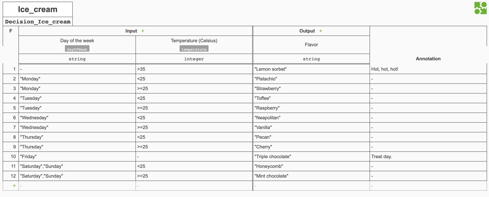
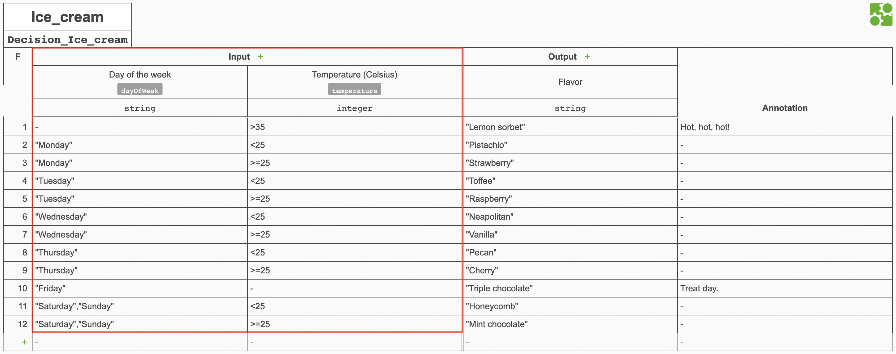
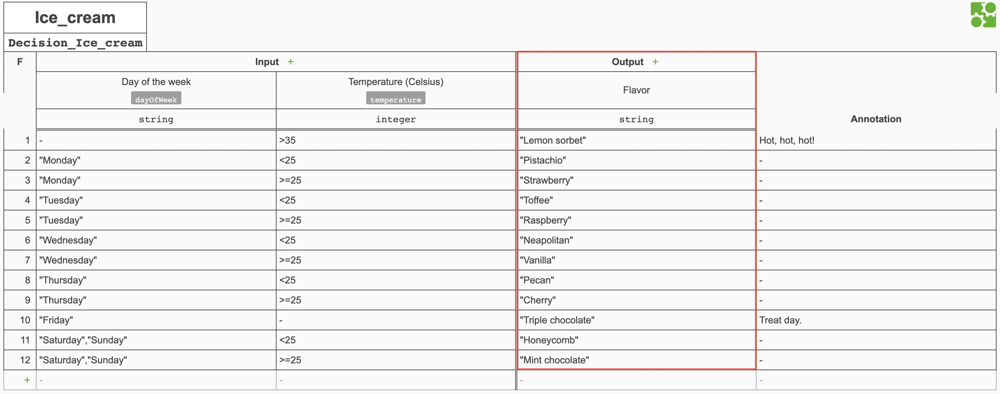
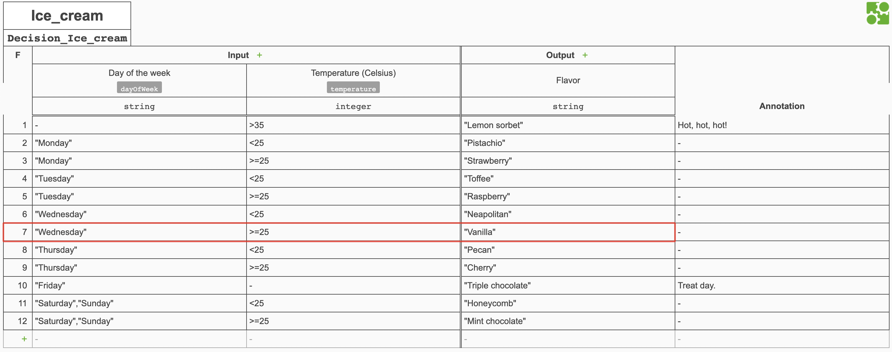
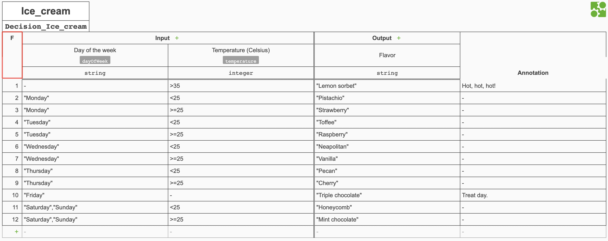
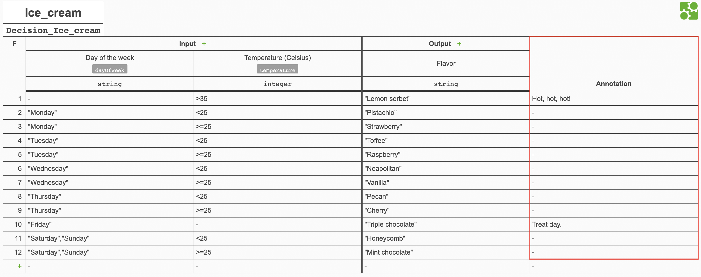

---
Title: Decision tables
--- 

# Decision tables
Decision tables are used to manage business decisions within process workflows. They adhere to the Decision Model and Notation (DMN) standard. 

Decision tables take at least one input and have at least one output. The inputs are evaluated against a set of rules defined by the modeler and then produce the relevant output(s) that match those rules to the process. 

## Using decision tables
Decision tables can be selected from the palette when designing a process. Once they have been dragged into the process definition, a dropdown list of decision tables available to the current project is displayed. 

Decision tables are handled as [service tasks](../modeling/modeling-processes/processes-bpmn/bpmn-service.md) by Activiti Enterprise and will always have the `implementation` value of `dmn-connector.EXECTUTE_TABLE`. The `name` of the decision table that is associated to the service task is stored in the [`<process-name>-extensions.json` file](../modeling/modeling-projects.md#files) as the `value` under the input `_activiti_dmn_table_`.

The following is an example of the XML for a decision table within a process definition:

```xml
<bpmn2:serviceTask id="ServiceTask_0gzhx4b" implementation="dmn-connector.EXECUTE_TABLE" />
```

The following is an example of the extensions JSON of a process containing a decision table:

```json
"mappings": {
   "ServiceTask_0v4ptl3": {
      "inputs": {
         "_activiti_dmn_table_": {
            "type": "static_value",
            "value": "Ice_cream"
         }
       }
    }
}
```

All the [process variables](../modeling/modeling-processes/README.md#process-variables) of a process are passed to a decision table and those that match the names of input variables in a decision table are evaluated. All output names are created as process variables and passed back to the process once a decision table has been executed. 

## Designing decision tables
The following is a decision table that selects the best flavor of ice cream to eat based on which day of the week it is and what the temperature is. This example will be used to assist in explaining the different elements that make up a decision table.



### General
Decision tables have a `name` and `id`, with the `name` being used to link a decision table to a service task. 

The following is the XML for the general properties of the ice cream decision table:

```xml
<decision id="Decision_Ice_cream" name="Ice_cream">
```

### Inputs
Input variables are the fields that pass values from a process into a decision table to be evaluated. In the ice cream decision table the input variables are `dayOfWeek` and `temperature` of data types `string` and `integer` respectively. These need to match the names of [process variables](../modeling/modeling-processes/README.md#process-variables) defined in a process that are then passed into the decision table as values. Inputs also contain a label which are `Day of the week` and `Temperature (Celsius)` in the example.

The following is the XML for input variable `dayOfWeek`:

```xml
<input id="InputClause_Ice_cream" label="Day of the week" activiti:inputVariable="dayOfWeek">
   <inputExpression id="LiteralExpression_Ice_cream" typeRef="string" />
</input>
```



Input entries, or values are the possible input values to match against for each rule in a decision table. In the ice cream example, possible values include `Monday` and `>=25`.

**Note**: Inputs can have a `-` in a column that matches any value passed in. This appears as blank in the associated XML. 

The following is the XML for the input entry of row 1:

```xml
<inputEntry id="UnaryTests_0pwpzaz">
   <text></text>
</inputEntry>
<inputEntry id="UnaryTests_0g2rex3">
   <text>&gt;35</text>
</inputEntry>
```

Input entries use the FEEL (Friendly Enough Expression Language) language.

### Outputs
Outputs are the result(s) that a decision table comes to after evaluating the inputs. Output columns have a `name` and a `label`. The `name` is used to pass the output value(s) from a decision table to a process. Process variables are created in the process with the same `name` as the output(s) from the decision table once it has been executed. In the ice cream decision table the output `name` is `flavor` and it is of data type `string`. 

The following is the XML for the output from the ice cream decision table

```xml
<output id="OutputClause_Ice_cream" label="Flavor" name="flavor" typeRef="string" />
```



Output entries are the possible outputs for each rule in a decision table. In the ice cream example, possible values include `Triple chocolate` and `Honeycomb`. 

The following is the output entry for row 10:

```xml
<outputEntry id="LiteralExpression_1olsqqv">
   <text>"Triple chocolate"</text>
</outputEntry>
```

### Rules
Each row in a decision table is known as a rule. A rule evaluates which outputs are valid for the input(s) provided. In the ice cream flavor example, the following are some of the rules:



* On a Monday when the temperature is below 25°c, you should eat pistachio ice cream.
* On a Wednesday when the temperature is 25°c or above, you should eat vanilla ice cream.
* On a Friday you should eat triple chocolate ice cream, irrespective of temperature. 
* On Saturdays or Sundays when the temperature is 25°c or above, you should mint chocolate ice cream.
* When the temperature is above 35°c you should eat lemon sorbet, irrespective of the day. 

**Note**: If there are multiple inputs in a single rule, decision tables use an *AND* operator between the inputs.

[Simulation](#simulating-decision-tables) allows you to see which rules are satisfied by testing input values. 

The XML for a rule is the combination of the input and output entries with a unique rule `id`. The following is an example for rule or row 12:

```xml
<rule id="DecisionRule_1drb7gg">
   <inputEntry id="UnaryTests_07yha3g">
      <text>"Saturday","Sunday"</text>
   </inputEntry>
   <inputEntry id="UnaryTests_00i1d80">
       <text>&gt;=25</text>
   </inputEntry>
   <outputEntry id="LiteralExpression_1i6ddhb">
        <text>"Mint chocolate"</text>
   </outputEntry>
</rule>
``` 

### Hit policies
Underneath the name of the decision table is a letter that sets the hit policy for a decision table. Hit policies are used to set how rules are evaluated when a decision table is executed. 

Using the ice cream example, the letter is `F` which is a `FIRST` hit policy. This means that whilst multiple rules can be matched, only the first one matched will be returned as the output. The rules are evaluated in the order they are defined in the decision table. 



Hit policies are defined at the top level of a decision table XML: 

```xml
<decisionTable id="DecisionTable_Ice_cream" hitPolicy="FIRST">
```

Other [hit policies](#hit-policy-types) can be used.  

### Annotations
On the far right of a decision table is a column for annotations. This is just a place to store notes and is only visible to the modeler. 



Annotations are contained in a `description` property of a rule in the XML: 

```xml
<rule id="DecisionRule_0vx00qh">
   <description>Treat day.</description>
...
</rule>
```

## Hit policy types 
Hit policies define how many rules can be matched in a decision table and which of the results are included in the output. 

The default hit policy is `UNIQUE`. 

| Hit policy | Description |
| ---------- | ----------- |
| `U`: `UNIQUE` | Only a single rule can be matched. If more than one rule is matched the hit policy is violated |
| `A`: `ANY` | Multiple rules can be matched. All matching rules must have identical entries for their output and if matching rules have different output entries the hit policy is violated | 
| `F`: `FIRST` |  Multiple rules can be matched. Only the output of the first rule that is matched will be used, with rules being evaluated in the order they are defined in the decision table | 
| `R`: `RULE ORDER` |  Multiple rules can be matched. All outputs are returned in the order that rules are defined in the decision table | 
| `O` : `OUTPUT ORDER` | Multiple rules can be matched. All outputs are returned in the order that output values are defined in the decision table |
| `P` : `PRIORITY` | Multiple rules can be matched. Only the output with the highest priority will be used, with priority being calculated based on the order rules are specified in descending order | 
| `C`: `COLLECT` | Multiple rules can be satisfied and multiple outputs will be generated with no ordering. Aggregators can be used to group the results which will generate only a single output. See the following rows for collect aggregators. |
| `C +`: ` COLLECT SUM` | The sum of the output values is used to generate a single output | 
|`C <`: `COLLECT MIN` | The lowest value output is used to generate a single output |
| `C >`: `COLLECT MAX`| The highest value output is used to generate a single output |
| `C #`: `COLLECT COUNT`| The total number of outputs is used to generate a single output |

## Simulating decision tables
Once you have designed a decision table, you can test which rules are satisfied by entering test input values.

In the UI click the **Simulate** button after entering the input values to simulate. The results will be populated in the outputs and the rules that were met will be highlighted in the decision table. 

The payload of the API accepts an XML file of the decision table definition, the table name and the test input values as `JSON` and returns the output values as `JSON`: 

```json
{
"name" : "Ice_cream",
"inputs" : { "dayOfWeek" : "Tuesday", "temperature" : 37 },
"xml": 
"<?xml version="1.0" encoding="UTF-8"?>
<definitions xmlns="http://www.omg.org/spec/DMN/20151101/dmn.xsd" xmlns:activiti="http://activiti.org/schema/1.0/dmn" id="decision-360aa1af-b233-4a05-82c4-215bade69087" name="Ice_cream" namespace="http://activiti.org/schema/1.0/dmn" exporter="dmn-js (https://demo.bpmn.io/dmn)" exporterVersion="6.2.1">
<decision id="Decision_Ice_cream" name="Ice_cream">
<decisionTable id="DecisionTable_Ice_cream" hitPolicy="FIRST">
<input id="InputClause_Ice_cream" label="Day of the week" activiti:inputVariable="dayOfWeek">
<inputExpression id="LiteralExpression_Ice_cream" typeRef="string" />
</input>
<input id="InputClause_0mw41g9" label="Temperature (Celsius)" activiti:inputVariable="temperature">
<inputExpression id="LiteralExpression_08loxfu" typeRef="integer">
<text></text>
</inputExpression>
</input>
<output id="OutputClause_Ice_cream" label="Flavor" name="ice cream" typeRef="string" />
<rule id="DecisionRule_04wc98o">
<description>Hot, hot, hot!</description>
<inputEntry id="UnaryTests_0pwpzaz">
<text></text>
</inputEntry>

...

<outputEntry id="LiteralExpression_1i6ddhb">
<text>"Mint chocolate"</text>
</outputEntry>
</rule>
</decisionTable>
</decision>
</definitions>"
}
```

**Note**: The XML used is the contents of the [`<decision-table-name>.xml`](../modeling/modeling-projects.md#files) file.
